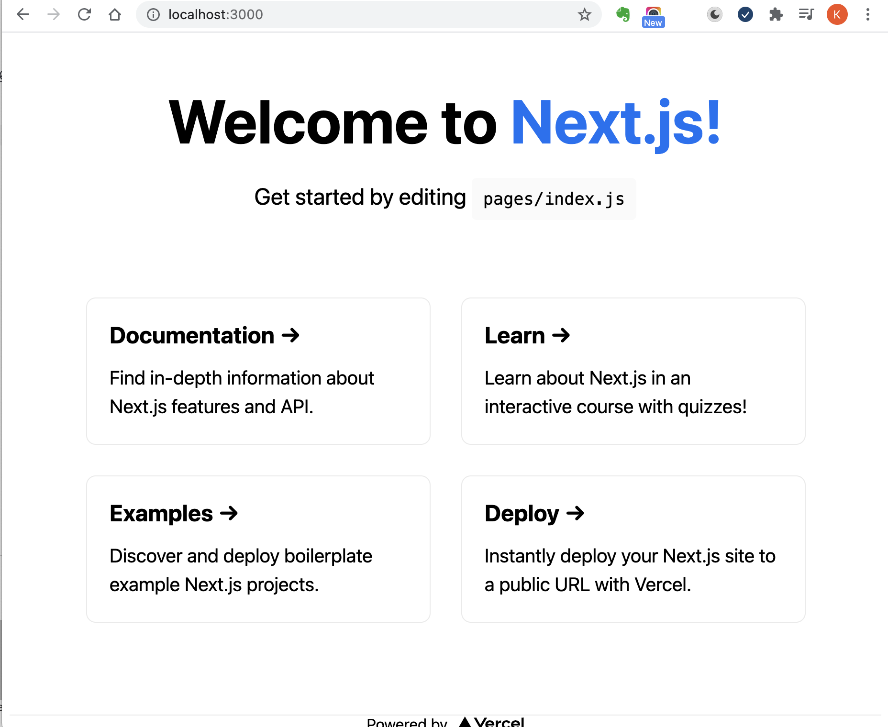

### 6.create-next-appとTailwind設定

#### 構築
```
npx create-next-app . --use-npm
```

#### 1. 起動
```
$ npm run dev

> nextjs_hp@0.1.0 dev
> next dev

ready - started server on 0.0.0.0:3000, url: http://localhost:3000
```

- ブラウザでhttp://localhost:3000より画面が確認できる


#### 2. Tailwindの設定
[参照URL:Install Tailwind CSS with Next.js](https://tailwindcss.com/docs/guides/nextjs)

##### 2-1 Tailwindのインストール
```
$ npm install -D tailwindcss@latest postcss@latest autoprefixer@latest
```

##### 2-2 Create your configuration files
```
$ npx tailwindcss init -p

  tailwindcss 2.1.4
  
   ✅ Created Tailwind config file: tailwind.config.js
   ✅ Created PostCSS config file: postcss.config.js
```

