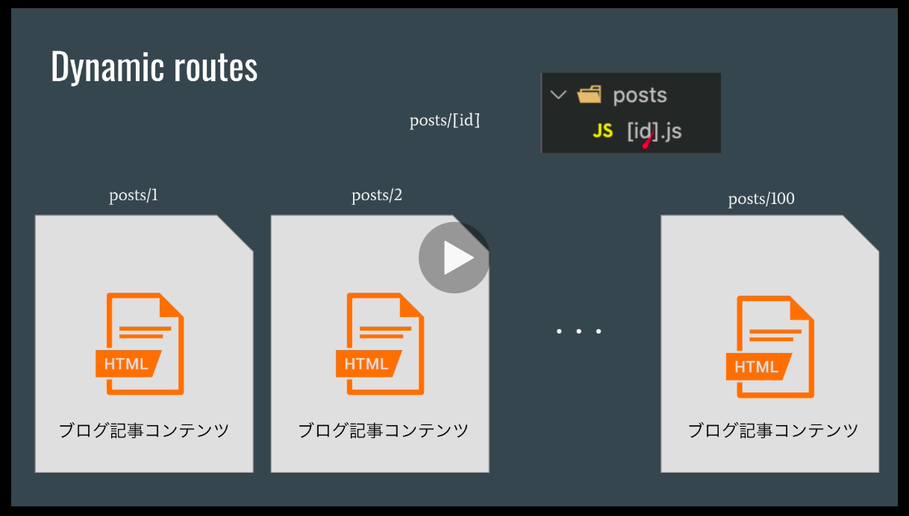
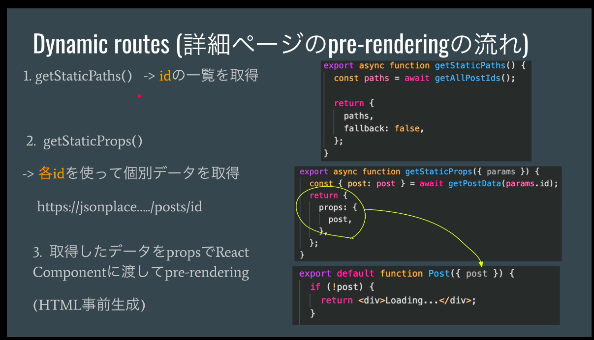

### 6.create-next-appとTailwind設定

#### 構築
```
npx create-next-app . --use-npm
```

#### 1. 起動
```
$ npm run dev

> nextjs_hp@0.1.0 dev
> next dev

ready - started server on 0.0.0.0:3000, url: http://localhost:3000
```

- ブラウザでhttp://localhost:3000より画面が確認できる


##### 1-1. 配布時ビルド
~~~
$ npm run build
~~~
- 下記内容となり、serverフォルダに出出力される
~~~
info  - Generating static pages (5/5)
info  - Finalizing page optimization  

Page                              Size     First Load JS
┌ ○ /                             802 B          69.5 kB
├   /_app                         0 B              63 kB
├ ○ /404                          3.06 kB          66 kB
├ λ /api/hello                    0 B              63 kB
├ ● /blog-page                    928 B          69.7 kB
└ ○ /contact-page                 2.38 kB        71.1 kB
+ First Load JS shared by all     63 kB
  ├ chunks/framework.64eb71.js    42 kB
  ├ chunks/main.71948a.js         19.4 kB
  ├ chunks/pages/_app.68b6ce.js   554 B
  ├ chunks/webpack.2a5a41.js      952 B
  └ css/d8c1a86bb4e09d6d485c.css  1.86 kB

λ  (Server)  server-side renders at runtime (uses getInitialProps or getServerSideProps)
○  (Static)  automatically rendered as static HTML (uses no initial props)
●  (SSG)     automatically generated as static HTML + JSON (uses getStaticProps)
   (ISR)     incremental static regeneration (uses revalidate in getStaticProps)
~~~

##### 1-2. テストサーバ起動
~~~
$ npm start
~~~
- 配布時ビルドを表示する
- localhost:3000で確認できる

##### 1-3. 備考
- 配布時ビルドに生成物のhtmlを自動整形する
  - 対象のHTMLを開いて（フォーカスを当てて）、option + shift + F キーで整形してくれる

  - <b>整形例</b>
    - 整形前
      ~~~html
      <!DOCTYPE html><html><head><meta name="viewport" content="width=device-width"/><meta charSet="utf-8"/><title>Blog</title><me 
      <!-- 以下省略 -->
      ~~~
    
    - 整形後
  
      ~~~html
      <!DOCTYPE html>
      <html>
        <head>
          <meta name="viewport" content="width=device-width" />
          <meta charset="utf-8" />
          <title>Blog</title>
          <meta name="next-head-count" content="3" />
          <link
            rel="preload"
            href="/_next/static/css/d8c1a86bb4e09d6d485c.css"
            as="style"
          />
          <!-- 途中略 -->
          <link
            rel="preload"
            href="/_next/static/chunks/pages/blog-page-a5a2ffcf16911c4be8a7.js"
            as="script"
          />
        </head>
        <body>
          <div id="__next">
            <div
              class="
                flex
                justify-center
                items-center
                flex-col
                min-h-screen
                text-gray-600 text-sm
                font-mono
              "

        <!-- 以下省略 -->
      ~~~

#### 2. Tailwindの設定
[参照URL:Install Tailwind CSS with Next.js](https://tailwindcss.com/docs/guides/nextjs)

- cssファイルに記載していた内容（style/Home.module.css）をtailwindで定義した内容に置き換えていく

##### 2-1 Tailwindのインストール
```
$ npm install -D tailwindcss@latest postcss@latest autoprefixer@latest
```

##### 2-2 Create your configuration files
```
$ npx tailwindcss init -p

  tailwindcss 2.1.4
  
   ✅ Created Tailwind config file: tailwind.config.js
   ✅ Created PostCSS config file: postcss.config.js
```

##### 2-3 Configure Tailwind to remove 
- tailwind.config.js
```
  module.exports = {
   - purge: [],
   + purge: ['./pages/**/*.{js,ts,jsx,tsx}', './components/**/*.{js,ts,jsx,tsx}'],
    darkMode: false, // or 'media' or 'class'
    theme: {
      extend: {},
    },
    variants: {
      extend: {},
    },
    plugins: [],
  }
```

##### 2-4 next.jsのページの概念


##### 2-5 tailwindのcheatsheet
[TailwindチートシートのURL](https://nerdcave.com/tailwind-cheat-sheet)


#### 3. LayoutComponentの適用
- Layout
- すべてのpageに共通的なものをもたせる
  - fotter. headerなど


- Reactのテンプレート作成
  - ソースコード上で、[rafce]と入力する


- 上記テンプレートからの変更点
  - NextJSはデフォルトでreactを利用するのimport不要
  ```javascript
  // import React from 'react'
  ```

  - コンポーネント名は大文字で始める
    - blog-page => Blog(大文字で始まる)に変更 

#### 4. Contact Pageの作成

#### 5. getStaticProps: **<u>build時に静的なページを事前に設定しておく!!</u>**
- brogページの作成
- 外部のblog APIより取得
  - {JSON} Placeholder
  
  
  [エンドポイント＿blogの取得：GETのURL](https://jsonplaceholder.typicode.com/posts)
```
[
  {
    "userId": 1,
    "id": 1,
    "title": "sunt aut facere repellat provident occaecati excepturi optio reprehenderit",
    "body": "quia et suscipit\nsuscipit recusandae consequuntur expedita et cum\nreprehenderit molestiae ut ut quas totam\nnostrum rerum est autem sunt rem eveniet architecto"
  },
  {
    "userId": 1,
    "id": 2,
    "title": "qui est esse",
    "body": "est rerum tempore vitae\nsequi sint nihil reprehenderit dolor beatae ea dolores neque\nfugiat blanditiis voluptate porro vel nihil molestiae ut reiciendis\nqui aperiam non debitis possimus qui neque nisi nulla"
  },
 
 # (途中略)

  {
      "userId": 10,
      "id": 99,
      "title": "temporibus sit alias delectus eligendi possimus magni",
      "body": "quo deleniti praesentium dicta non quod\naut est molestias\nmolestias et officia quis nihil\nitaque dolorem quia"
  },
  {
    "userId": 10,
    "id": 100,
    "title": "at nam consequatur ea labore ea harum",
    "body": "cupiditate quo est a modi nesciunt soluta\nipsa voluptas error itaque dicta in\nautem qui minus magnam et distinctio eum\naccusamus ratione error aut"
  }
]

```
- 下図の「2:SSG-Pre-fetch」が該当する
  - build時に外部APIより100件のblogデータを取得する
  - 事前にHTMLを作成しておく


- getStaicPropsの仕組み
  - getStaticProps()を記述しておくと起動時にコールしてくれる
  - 開発時
    - npm run dev : リクエストごとに実行される
  - デブロイ時（本番稼働時）
    - npm start : ビルド時のみ実行される

  - 処理の流れ
    1. 起動時（ビルド時orリクエストごと）にgetStaticPropsメソッドがコールされる
    2. エンドポイントをfetchするメソッド：getAllPostsData()によりpost一覧=postsを取得
    3. 取得した「posts」を【Blog】コンポーネントに渡す
    4. 【Blog】コンポーネント内でpostsがmapされてbrog一覧が表示される


#### 6. getStaticPaths (Dynamic routes)
- 詳細ページを表示





#### 7.Deploy to Vercel
- git-hubにデプロイする

[Deploying Your Next.js Appのリンク先](https://nextjs.org/learn/basics/deploying-nextjs-app/deploy)

- git-hub authorization token:
  ~~~
  vscode://vscode.github-authentication/did-authenticate?windowid=1&code=40ded707bff8b436ab95&state=267b92ad-7853-4866-b535-8020e475879c
  ~~~

