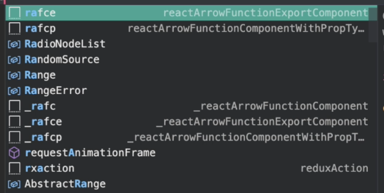

### 6.create-next-appとTailwind設定

#### 構築
```
npx create-next-app . --use-npm
```

#### 1. 起動
```
$ npm run dev

> nextjs_hp@0.1.0 dev
> next dev

ready - started server on 0.0.0.0:3000, url: http://localhost:3000
```

- ブラウザでhttp://localhost:3000より画面が確認できる


#### 2. Tailwindの設定
[参照URL:Install Tailwind CSS with Next.js](https://tailwindcss.com/docs/guides/nextjs)

- cssファイルに記載していた内容（style/Home.module.css）をtailwindで定義した内容に置き換えていく

##### 2-1 Tailwindのインストール
```
$ npm install -D tailwindcss@latest postcss@latest autoprefixer@latest
```

##### 2-2 Create your configuration files
```
$ npx tailwindcss init -p

  tailwindcss 2.1.4
  
   ✅ Created Tailwind config file: tailwind.config.js
   ✅ Created PostCSS config file: postcss.config.js
```

##### 2-3 Configure Tailwind to remove 
- tailwind.config.js
```
  module.exports = {
   - purge: [],
   + purge: ['./pages/**/*.{js,ts,jsx,tsx}', './components/**/*.{js,ts,jsx,tsx}'],
    darkMode: false, // or 'media' or 'class'
    theme: {
      extend: {},
    },
    variants: {
      extend: {},
    },
    plugins: [],
  }
```

##### 2-4 next.jsのページの概念


##### 2-5 tailwindのcheatsheet
[TailwindチートシートのURL](https://nerdcave.com/tailwind-cheat-sheet)


#### 3. LayoutComponent
- Layout
- すべてのpageに共通的なものをもたせる
  - fotter. headerなど


- Reactのテンプレート作成
  - ソースコード上で、[rafce]と入力する


- 上記テンプレートからの変更点
  - NextJSはデフォルトでreactを利用するのimport不要
  ```javascript
  // import React from 'react'
  ```

  - コンポーネント名は大文字で始める
    - blog-page => Blog(大文字で始まる)に変更 